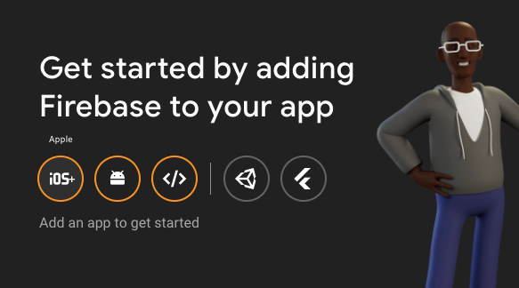
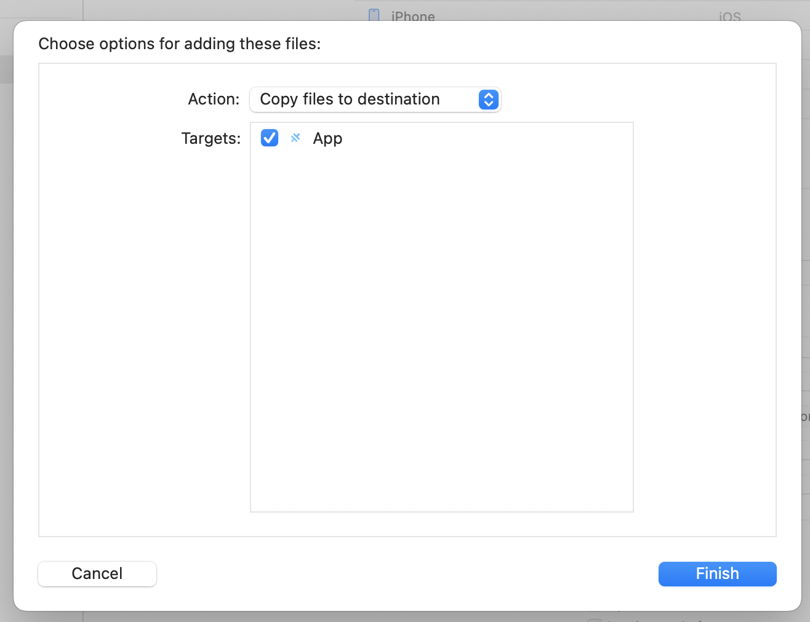
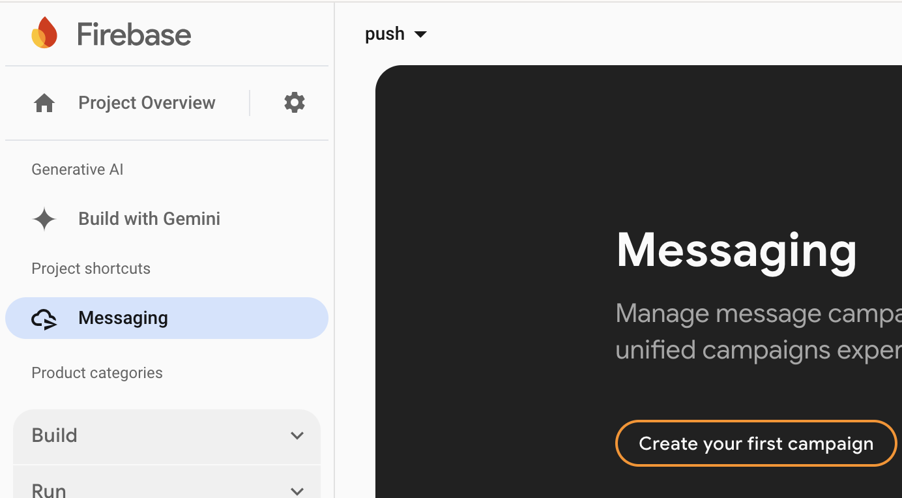

# How to configure push notifications

## iOS

### Create and configure Firebase Console project
1. Create a new Firebase project on [Firebase Console](https://console.firebase.google.com/) with disabled Google Analytics.
2. On Project overview, add a new iOS app. 

3. Enter bundle ID of the app (`com.etacarSystem.pushNotifiationDemo` for this project) and press `Register app` button.
4. Download `GoogleService-Info.plist` file. 
5. Open `ios/App` directory in XCode. Then add downloded `.plist` file to `ios/App/App` directory (using drag-and-drop).

6. Skip `Add Firebase SDK` & `Add initialisation code` steps on Firebase Console by pressing `Next` buttons.
7. Open project settings on Firebase Console and go to `Cloud Messaging` tab. At `Apple app configurationApple app configuration` section and under `APNs Authentication Key`, press `Upload` button. Upload APNS key file and enter `XT6A687MSK` in `Key ID` field & `7LGT8H5K7C` at `Team ID` field.

8. Run `npm i`
9. Run `npm i -g @ionic/cli`
10. Run `ionic cap sync`. If you face an error related to pods, run `cd ios/App && pod install --repo-update && cd ../../` and then try `ionic cap sync` again.
11. Run `npm run ios:open`. Then build & run an iOS app in Xcode.
12. Create a new Firebase CM campaign (`Firebase Notifications messages` option). Enter a title and a text of a new notification, then press `Next`. Select a target iOS app `com.etacarSystem.pushNotifiationDemo` and the press `Review`, `Publish`. You should see the test notification in about a minute. 

## Android

13. Similary to the 2nd step, add a new Android app in Firebase Console. Enter `com.etacarSystem.pushNotifiationDemo` in `Android package name` field & press `Register app` button.
14. Download `google-services.json` and place the file under `android/app` directory.
15. Skip `Add Firebase SDK` step.
16. Run `npm run android:open`. Build & run an Android app.
17. Similary to the 12th step, create a new Firebase CM campaign but select the Android app `com.etacarSystem.pushNotifiationDemo`. You should see the test notification in about a minute. 